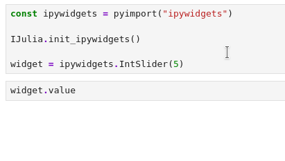
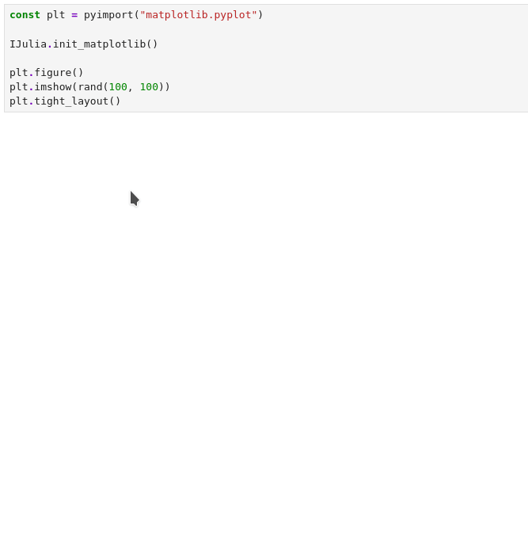
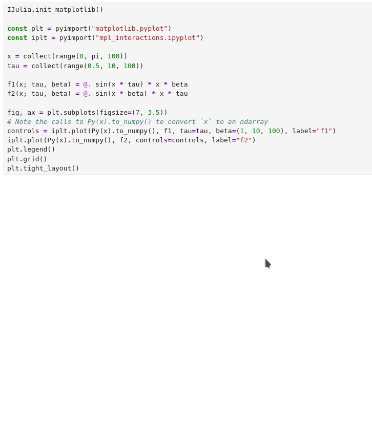

# Using IJulia

There are various features of IJulia that allow you to interact with a
running IJulia kernel.


## General


### Detecting that code is running under IJulia

If your code needs to detect whether it is running in an IJulia notebook
(or other Jupyter client), it can check `isdefined(Main, :IJulia) && Main.IJulia.inited`.


### Julia projects

The default Jupyter kernel that is installed by IJulia starts with the
Julia command line flag `--project=@.`. A  `Project.toml` (or `JuliaProject.toml`)
in the folder of a notebook (or in a parent folder of this notebook) will
therefore automatically become the active project for that notebook.
Users that don't want this behavior should install an additional IJulia
kernel without that command line flag (see section
[Installing and customizing kernels](@ref)).

If an existing `Project.toml` file is not found then, by default, an IJulia notebook will try to run a Julia kernel
with its active project set from the global or default environment (usually of the form `~/.julia/environments/v1.x`).
If the IJulia package is not installed in that environment, then the Julia kernel selected by default will not be able to
connect, and a **Connection failed** error will be displayed. In this case, users should install a additional
Julia kernel that uses their chosen Julia environment.
For example, if the desired environment is currently activated in the REPL then one possibility is to execute
```julia
IJulia.installkernel("Julia MyProjectEnv", "--project=$(Base.active_project())")
```
and subsequently select the kernel starting with `Julia MyProjectEnv` from _Kernel > Change Kernel_ in the menu of the Jupyter notebook.

### Customizing your IJulia environment

If you want to run code every time you start IJulia---but only when in IJulia---add a `startup_ijulia.jl` file to your Julia `config` directory, e.g., `~/.julia/config/startup_ijulia.jl`.


### Julia and IPython Magics

One difference from IPython is that the IJulia kernel does
not use "magics", which are special commands prefixed with `%` or
`%%` to execute code in a different language.   Instead, other
syntaxes to accomplish the same goals are more natural in Julia,
work in environments outside of IJulia code cells, and are often
more powerful.

However, if you enter an IPython magic command
in an IJulia code cell, it will print help explaining how to
achieve a similar effect in Julia if possible.
For example, the analogue of IPython's `%load filename` in IJulia
is `IJulia.load("filename")`.


## Input and output

### Prompting for user input

When you are running in a notebook, ordinary I/O functions on `stdin` do
not function.   However, you can prompt for the user to enter a string
in one of two ways:

* `readline()` and `readline(stdin)` both open a `stdin>` prompt widget where the user can enter a string, which is returned by `readline`.

* `IJulia.readprompt(prompt)` displays the prompt string `prompt` and
  returns a string entered by the user.  `IJulia.readprompt(prompt, password=true)` does the same thing but hides the text the user types.


### Clearing output

Analogous to the [IPython.display.clear_output()](http://ipython.org/ipython-doc/dev/api/generated/IPython.display.html#IPython.display.clear_output) function in IPython, IJulia provides a function:

```julia
IJulia.clear_output(wait=false)
```

to clear the output from the current input cell.  If the optional
`wait` argument is `true`, then the front-end waits to clear the
output until a new output is available to replace it (to minimize
flickering).  This is useful to make simple animations, via repeated
calls to `IJulia.clear_output(true)` followed by calls to
`display(...)` to display a new animation frame.


### Input and output history

IJulia will store dictionaries of the user's input and output history
for each session in exported variables called `In` and `Out`. To recall
old inputs and outputs, simply index into them, e.g. `In[1]` or `Out[5]`. Sometimes, a user
may find themselves outputting large matrices or other datastructures which
will be stored in `Out` and hence not garbage collected, possibly hogging memory.
If you find that IJulia is using too much memory after generating large outputs, empty this output dictionary:
```julia
empty!(Out)
```


### Default display size

When Julia displays a large data structure such as a matrix, by default
it truncates the display to a given number of lines and columns.  In IJulia,
this truncation is to 30 lines and 80 columns by default.   You can change
this default by the `LINES` and `COLUMNS` environment variables, respectively,
which can also be changed within IJulia via `ENV` (e.g. `ENV["LINES"] = 60`).
(Like in the REPL, you can also display non-truncated data structures via `print(x)`.)


### Preventing truncation of output

The new default behavior of IJulia is to truncate stdout (via `show` or `println`)
after 512kb. This to prevent browsers from getting bogged down when displaying the
results. This limit can be increased to a custom value, like 1MB, as follows

```julia
IJulia.set_max_stdio(1 << 20)
```


## Execution


### Setting the current module

The module that code in an input cell is evaluated in can be set using `Main.IJulia.set_current_module(::Module)`.
It defaults to `Main`.


### Opting out of soft scope

By default, IJulia evaluates user code using "soft" global scope, via the [SoftGlobalScope.jl package](https://github.com/stevengj/SoftGlobalScope.jl): this means that you don't need explicit `global` declarations to modify global variables in `for` loops and similar, which is convenient for interactive use.

To opt out of this behavior, making notebooks behave similarly to global code in Julia `.jl` files,
you can set `IJulia.SOFTSCOPE[] = false` at runtime, or include the environment variable `IJULIA_SOFTSCOPE=no`
environment of the IJulia kernel when it is launched.

## Python integration

IJulia has an extension for PythonCall.jl that can integrate with ipywidgets and
matplotlib to allow using their interactive widgets. Usage in Julia should be
almost exactly the same as in Python, with the caveat that some libraries may
expect `numpy.ndarray` arguments and not know what to do with
`juliacall.ArrayValue` arguments (see the `mpl-interactions` example). In this
case you should convert the array to an `ndarray` by calling `Py(x).to_numpy()`.

To enable the integrations you should call one of the [Python initializer
functions](../library/public.md#Python-initializers) *after* loading PythonCall
and *before* importing any other Python libraries. Otherwise some hooks may be
set up too late.

### Examples

Ipywidgets:
```julia
using PythonCall
IJulia.init_ipywidgets()
const ipywidgets = pyimport("ipywidgets")

widget = ipywidgets.IntSlider(5)

widget.value
```


Matplotlib:
```julia
using PythonCall
IJulia.init_matplotlib()
const plt = pyimport("matplotlib.pyplot")

plt.figure()
plt.imshow(rand(100, 100))
plt.tight_layout()
```


And a more complex example with
[mpl-interactions](https://mpl-interactions.readthedocs.io/en/stable/):
```julia
using PythonCall
IJulia.init_matplotlib()

const plt = pyimport("matplotlib.pyplot")
const iplt = pyimport("mpl_interactions.ipyplot")

x = collect(range(0, pi, 100))
tau = collect(range(0.5, 10, 100))

f1(x; tau, beta) = @. sin(x * tau) * x * beta
f2(x; tau, beta) = @. sin(x * beta) * x * tau

fig, ax = plt.subplots(figsize=(7, 3.5))
# Note the calls to Py(x).to_numpy() to convert `x` to an ndarray
controls = iplt.plot(Py(x).to_numpy(), f1, tau=tau, beta=(1, 10, 100), label="f1")
iplt.plot(Py(x).to_numpy(), f2, controls=controls, label="f2")
plt.legend()
plt.grid()
plt.tight_layout()
```

